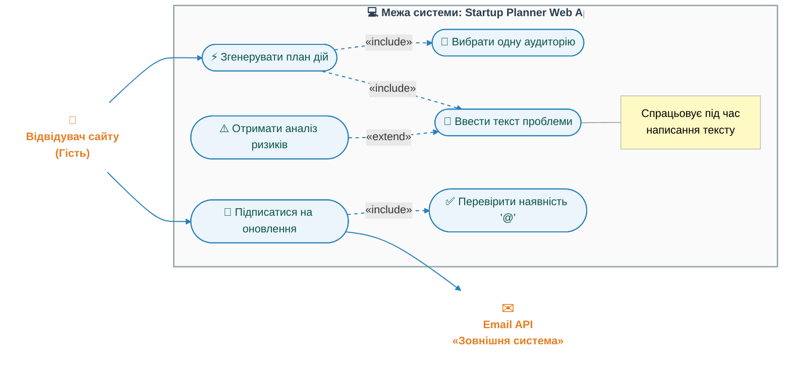
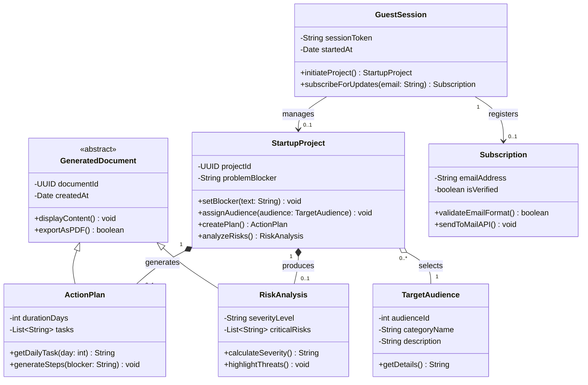
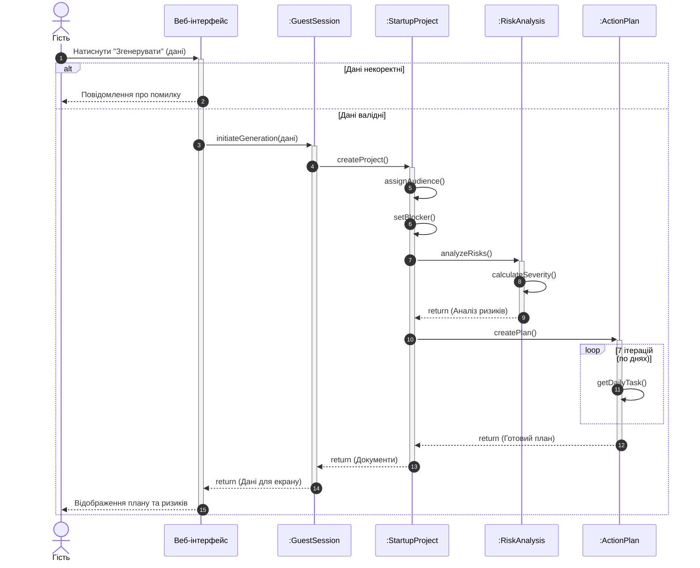

# Лабораторна робота: Моделювання вимог

**Проєкт:** Startup Planner

**Виконала:** Плохотнікова Анастасія

## Крок 1. Обрати проєкт
**Опис:** Startup Planner - веб-сервіс, який допомагає творцям стартапів сфокусуватися на одній цільовій аудиторії, зрозуміти свою найбільшу проблему та автоматично скласти чіткий план дій на тиждень.

## Крок 2. Функціональні вимоги
**FR-01:** Сайт має працювати без реєстрації, логінів та паролів.

**FR-02:** Користувач повинен мати можливість вибрати лише одну головну аудиторію (сайт має забороняти вибирати декілька варіантів одночасно).

**FR-03:** На сайті має бути текстове поле, де людина може описати, що їй найбільше заважає працювати (її проблему).

**FR-04:** Сайт повинен аналізувати цю проблему і показувати можливі ризики.

**FR-05:** В кінці сайт повинен автоматично видати готовий план завдань на найближчі 7 днів.

**FR-06:** На головній сторінці має бути віконце, куди можна вписати свій email, щоб підписатися на оновлення.

**FR-07:** Сайт має перевіряти, чи правильно людина ввела email (чи є там значок "@").

## Крок 3. Use Case Diagram

## Крок 4. Class Diagram

## Крок 5. Sequence Diagram

## Крок 6. Traceability Matrix
### Таблиця 2.2 — Матриця трасовності

| Вимога | Use Case | Класи | Sequence |
| :--- | :--- | :--- | :--- |
| **FR-01** | — *(Системна вимога)* | `GuestSession` | SD-01 (Ініціалізація сесії) |
| **FR-02** | UC-02 (Вибрати аудиторію) | `StartupProject`, `TargetAudience` | SD-01 (Генерація плану) |
| **FR-03** | UC-03 (Ввести проблему) | `StartupProject` | SD-01 (Генерація плану) |
| **FR-04** | UC-04 (Аналіз ризиків) | `StartupProject`, `RiskAnalysis` | SD-01 (Генерація плану) |
| **FR-05** | UC-01 (Згенерувати план) | `GuestSession`, `StartupProject`, `ActionPlan` | SD-01 (Генерація плану) |
| **FR-06** | UC-05 (Підписка на оновлення) | `GuestSession`, `Subscription` | — |
| **FR-07** | UC-06 (Валідувати email) | `Subscription` | — |
